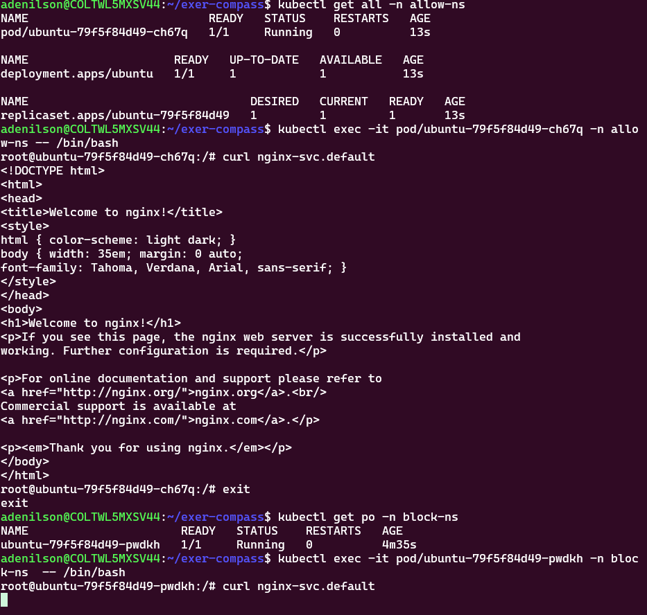
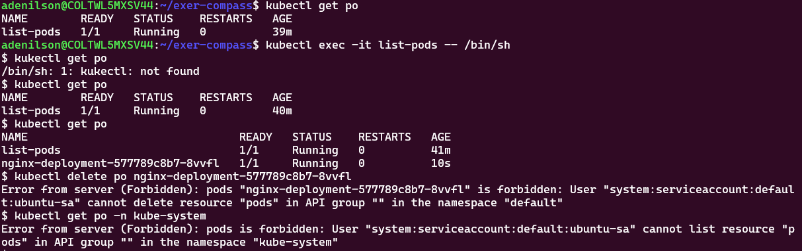
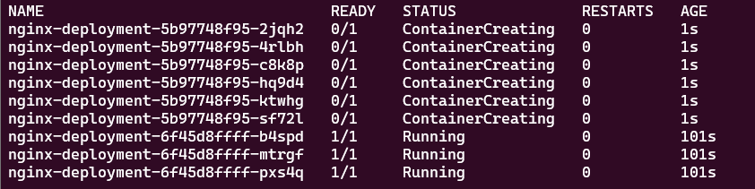

- Exercicio 1


- Exercicio 2

- Descrição do Deployment


- Exercicio 3 

- Exercicio 4

- Exercicio 5

- Exercício 6


- Está respondento no nodePort do Kind, que faz o Bind com a 8080 do host


- Exercício 7
  - Pods do namespace allow-ns pode acessar o nginx-svc no namespace default
  - A permissão é através  da label access:allow  configurada no namespace
  - Qualquer pod em um namespace com essa label tem acesso permitido


- Exercício 9
  - Pod de kubectl da bitnami, com role para listar apenas pods no default
  - Não exclui, Não lista outros NS 


- Exercício 10
  - Não vai rodar como root, vai rodar com usuário id 1000, nesse caso ubuntu
  - Se for um usuário não cadastrado, vai rodar nonamed
  - É possível ver que o usuário não possui permissões para arquivos root
  - Ao usar essa política precisa levar em conta a necessidade de permissões para funcionamento da aplicação.


- Exercício 12
  - Estratégia cria 50% destroy 50%  ao mesmo tempo - se ocorrer tudo bem com pods novos na primeira ação executa o restante
  - Posso:
     - Subir primeiro pods novos, depois destruir antigos (maxUnavalable = 0)
     - Posso destruir antigos primeiro, depois criar novos (maxSurge = 0)
     - Posso fazer essa troca em valores percentuais
     - Posso fazer essa troca com valores númericos ( de n em n)  
     ```YAML
       strategy:
        type: RollingUpdate
        rollingUpdate:
          maxSurge: 50%
          maxUnavailable: 50%
     ```


- Caso haja algum erro, esse tipo de deploy não continua o update para o próximo passo.
  - Permitindo que a aplicação continue disponível para os usuários, mesmo que, com performance menor.