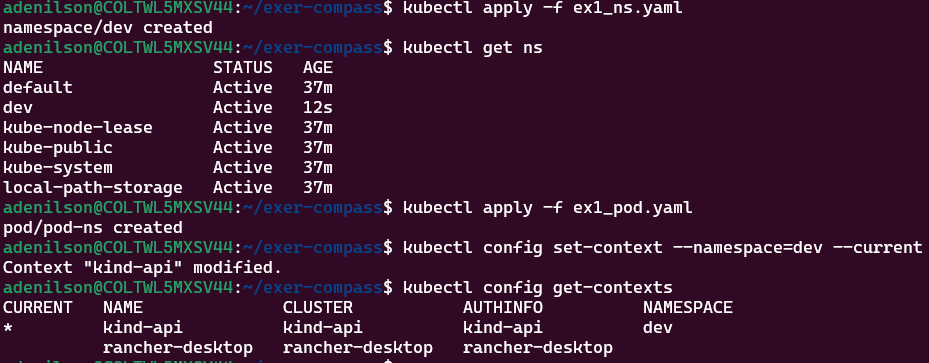
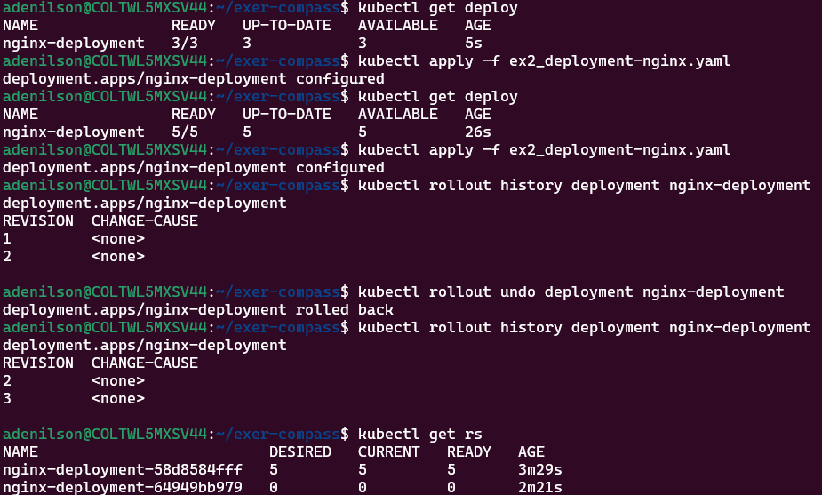
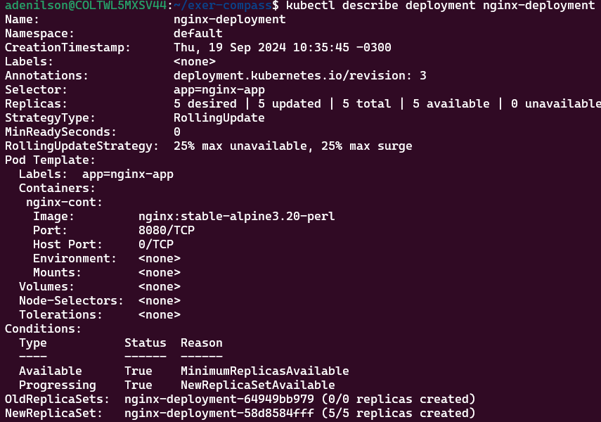
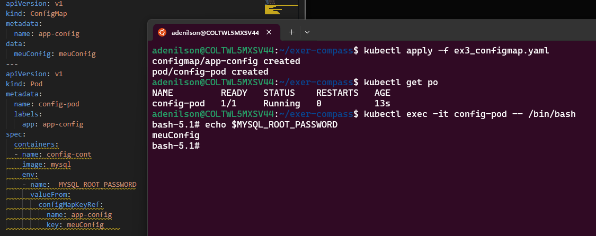
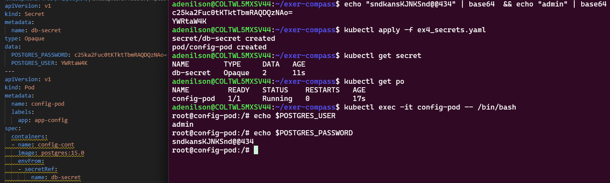
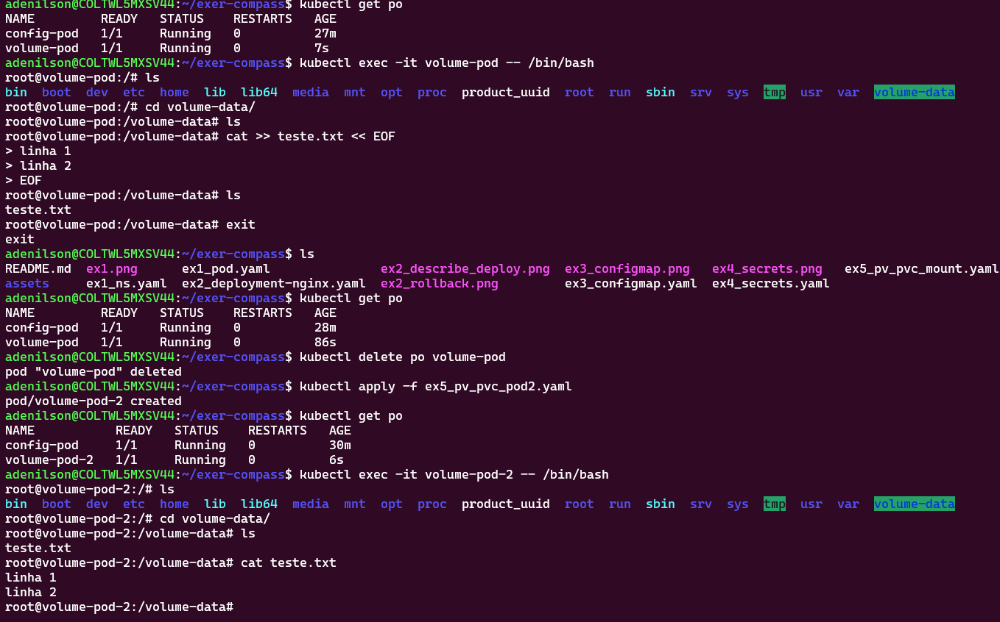
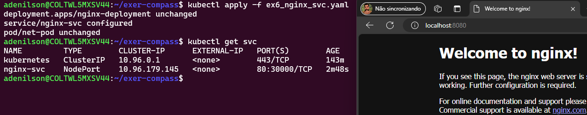

- Exercicio 1

- Exercicio 2

- Descrição do Deployment

- Exercicio 3 

- Exercicio 4

- Exercicio 5

- Exercício 6

- Está respondento no nodePort do Kind, que faz o Bind com a 8080 do host
