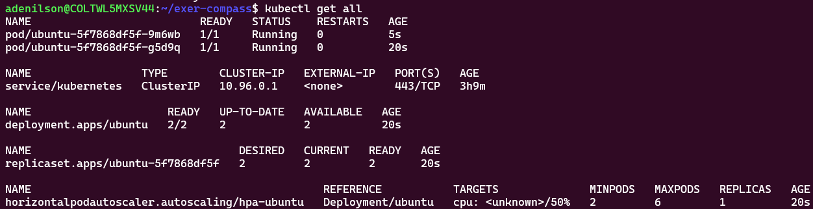
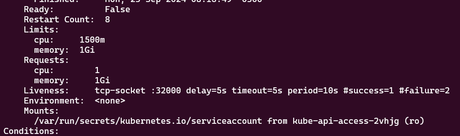
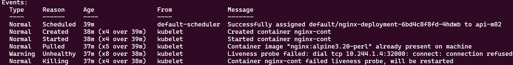
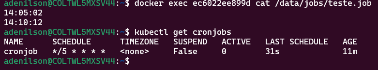
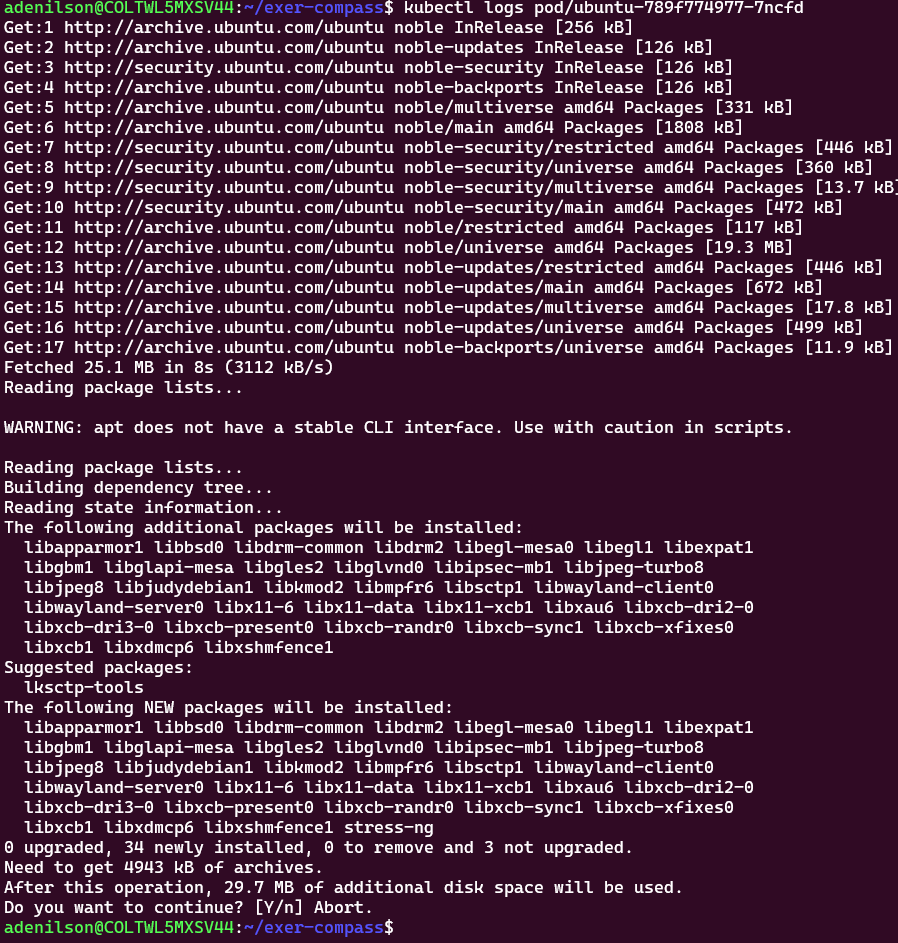

- Exercicio 1


- Exercicio 2

- Descrição do Deployment


- Exercicio 3 

- Exercicio 4

- Exercicio 5

- Exercício 6


- Está respondento no nodePort do Kind, que faz o Bind com a 8080 do host


- Exercício 7
  - Pods do namespace allow-ns pode acessar o nginx-svc no namespace default
  - A permissão é através  da label access:allow  configurada no namespace
  - Qualquer pod em um namespace com essa label tem acesso permitido


- Exercício 8
  - **WSL** : Necessário aplicar o comonado ``` minikube tunnel ```, para exibir o ingress no localhost do windows.

- Exercício 9
  - Pod de kubectl da bitnami, com role para listar apenas pods no default
  - Não exclui, Não lista outros NS 


- Exercício 10
  - Não vai rodar como root, vai rodar com usuário id 1000, nesse caso ubuntu
  - Se for um usuário não cadastrado, vai rodar nonamed
  - É possível ver que o usuário não possui permissões para arquivos root
  - Ao usar essa política precisa levar em conta a necessidade de permissões para funcionamento da aplicação.


- Exercpicio 11
- Mesmo que o Replicas no Deployment seja 1, o número mínimo de pods será o configurado no HPA



- Scaling


- Exercício 12
  - Estratégia cria 50% destroy 50%  ao mesmo tempo - se ocorrer tudo bem com pods novos na primeira ação executa o restante
  - Posso:
     - Subir primeiro pods novos, depois destruir antigos (maxUnavalable = 0)
     - Posso destruir antigos primeiro, depois criar novos (maxSurge = 0)
     - Posso fazer essa troca em valores percentuais
     - Posso fazer essa troca com valores númericos ( de n em n)  
     ```YAML
       strategy:
        type: RollingUpdate
        rollingUpdate:
          maxSurge: 50%
          maxUnavailable: 50%
     ```


- Caso haja algum erro, esse tipo de deploy não continua o update para o próximo passo.
  - Permitindo que a aplicação continue disponível para os usuários, mesmo que, com performance menor.

- Exercício 15 -  LivenessProbe 
- LivenessProbe: Verifica se a aplicação está em funcionamento dentro do POD, pode acontecer do POD estar ok, mas a plicação indisponível. No modo HTTP podemos fazer requisições para o /health. 
  - LivenessProbe tipo TCP, nesse caso pingando na 32000 que não está disponível.
  - Vai tentar a cada 10 segundos, com 2 falhas consecutivas reinicia o container, depois de um sucesso assume como ok o novo status.



- Exercício 13 - Job e Cronjob
  - Nesse caso executei um cron que a cada 5 minutos grava o horário no arquivo, dentro do volume montado no pod.



Exercício 15 - ReadinessProbe
 - Configuração similar ao LivenessProbe, mas objetivo diferente:
   - Verifica se a aplicação está pronta para receber requisições, não reinicia o container, apenas não libera para receber requisições, até que em alguma verificação retorne como pronto.
   
  ```YAML
          readinessProbe:
          exec:
            command: ["/bin/bash", "-c", "cat $HOME/ready.txt"]
          initialDelaySeconds: 10
          periodSeconds: 10
          failureThreshold: 1
          successThreshold: 2
          timeoutSeconds: 2
  ```
  - Nesse caso: 
    - Verifica se o arquivo ready.txt existe e pode ser lido, se ok libera o container para receber trafego 
- Exercício 16: 
  - Erro desproposital, não colocar -y ao instalar pacotes na inicialização 


